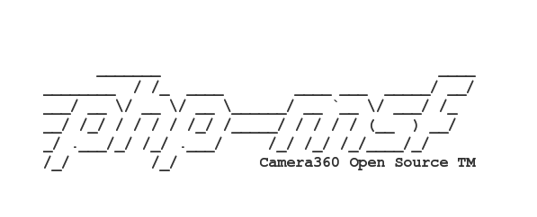

<p align="center">

</p>

<p align="center">


<p/>

# Micro Service Framework For PHP

PHP微服务框架即“Micro Service Framework For PHP”，是[Camera360](https://www.camera360.com)社区服务器端团队基于[Swoole](http://www.swoole.com)自主研发现代化的PHP协程服务框架，简称msf或者php-msf，是[Swoole](http://www.swoole.com)的工程级企业应用框架，经受了Camera360亿级用户高并发大流量的考验。php-msf由[Camera360](https://www.camera360.com)服务器团队主导研发，会持续更新与维护，也希望有更多优秀的[Swoole](http://www.swoole.com)应用实践开发者加入。php-msf核心设计思想是采用协程、异步、并行的创新技术手段提高系统的单机吞吐能力，降低整体服务器成本。

## 主要特性

* 精简版的MVC框架
* IO密集性业务的单机处理能力提升5-10倍
* 代码常驻内存
* 支持对象池
* 支持Redis连接池、MySQL连接池（异步与同步）
* 内置Redis Proxy，支持分布式、master-slave集群（故障自动failover与recovery）
* 内置MySQL Proxy，master-slave集群（读写分离、事务）
* 支持异步、并行
* 基于PHP Yield实现协程
* 内建http/redis/mysql/mongodb/task等协程客户端
* 纯异步的Http Server
* RPC Server/Client
* 支持命令行模式
* 支持独立进程的定时器
* 支持独立配置进程
* 支持sendfile静态文件(需配置root目录)

## 环境要求

- Linux，FreeBSD，MacOS(有兼容问题)
- Linux内核版本2.3.32以上(支持epoll)
- PHP-7.0及以上版本（生产环境建议使用PHP-7.1）
- gcc-4.4以上版本
- [swoole-1.9.15](https://github.com/swoole/swoole-src/archive/v1.9.15.tar.gz)及以上版本（暂不支持Swoole-2.0）
- [hiredis-0.13.3](https://github.com/redis/hiredis/archive/v0.13.3.tar.gz)
- [yac](https://github.com/laruence/yac/archive/yac-2.0.2.tar.gz)
- [phpredis](http://pecl.php.net/get/redis-3.1.2.tgz)
- composer

## 文档

框架手册(Gitbook): [PHP-MSF开发手册](https://pinguo.gitbooks.io/php-msf-docs/)

API Document(Rawgit): [类文档](https://cdn.rawgit.com/pinguo/php-msf-docs/4e0ed09d/api-document/index.html)

示例DEMO项目: [PHP-MSF DEMO](https://github.com/pinguo/php-msf-demo)

帮助完善文档: [https://github.com/pinguo/php-msf-docs](https://github.com/pinguo/php-msf-docs)，请提交PR。

## 交流与反馈

PHP-MSF#1群(QQ): 614054288

## 快速起步

```bash
$>php -r "copy('https://raw.githubusercontent.com/pinguo/php-msf-docker/master/installer.php', 'installer.php');include('installer.php');" && source ~/.bashrc
```

`installer.php`会检查运行环境，根据你的自定义配置，自动创建项目模板，composer安装依赖，启动服务。如果`cdn.rawgit.com`无法访问，可以直接克隆或者下载[php-msf-docker](https://github.com/pinguo/php-msf-docker)，提取`installer.php`，然后直接运行`php installer.php`

如果一切顺利，运行到最后你将看到如下的输出：

```bash
[2017-09-06 16:08:34] Run composer install success
[2017-09-06 16:08:34] Congratulations, all are installed successfully!
[2017-09-06 16:08:34] You can, visit http://127.0.0.1:8990/Welcome for test
      _______                               ____
________  / /_  ____        ____ ___  _____/ __/
___/ __ \/ __ \/ __ \______/ __ `__ \/ ___/ /_
__/ /_/ / / / / /_/ /_____/ / / / / (__  ) __/
_/ .___/_/ /_/ .___/     /_/ /_/ /_/____/_/
/_/         /_/         Camera360 Open Source TM
[2017-09-06 16:08:34] Swoole  Version: 1.9.18
[2017-09-06 16:08:34] PHP     Version: 7.1.8
[2017-09-06 16:08:34] Application ENV: docker
[2017-09-06 16:08:34] Listen     Addr: 0.0.0.0
[2017-09-06 16:08:34] Listen     Port: 8990
```

访问测试：

```bash
$>curl http://127.0.0.1:8990/Welcome
hello world!
```

注意端口，如果你不是8990，你需要修改，然后访问测试。

## 标准应用结构

```
├── app // PHP业务代码
│   ├── AppServer.php // 应用server类，可根据需求自定义
│   ├── Controllers // 控制器类目录
│   ├── Lib // 特殊逻辑处理类目录
│   ├── Models // Model类目录
│   ├── Route // 特殊路由规则类目录
│   ├── Tasks // Task类目录
│   └── Views // 视图文件目录
├── build.sh // 构建脚本（拉取docker镜像，启动容器）
├── checkstyle.sh // 代码检查脚本
├── composer.json // composer包依赖配置文件
├── config // 配置目录
├── server.php // server启动脚本
├── console.php // 命令行脚本
├── test // 单元测试目录
```

上述为基于php-msf的标准应用结构，一键安装程序installer.php会自动生成目录，用户可以根据需求创建一些自定义目录，只要符合psr4标准即可自动加载。

## 服务启动

调试模式

```bash
$>./server.php start
```

Daemon模式

```bash
$>./server.php start -d
```


停止服务

```bash
$>./server.php stop
```

重启服务

```bash
$>./server.php restart
```

## Docker

我们制作了Docker镜像，方便Docker用户快速的安装环境，运行[PHP-MSF DEMO](https://github.com/pinguo/php-msf-demo)工程。另外期望在开发环境修改代码实时预览效果，建议使用Docker for [Mac](https://download.docker.com/mac/stable/Docker.dmg)/[Windows](https://download.docker.com/win/stable/InstallDocker.msi)桌面版。

如果是升级Docker，它会自动迁移原有的镜像和容器，请耐心等待，千万不能中途kill掉Docker进程，否则再想迁移就难了。

Docker Registry(阿里云):

- 公网地址: `docker pull registry.cn-hangzhou.aliyuncs.com/pinguo-ops/php-msf-docker:latest`
- 经典内网: `docker pull registry-internal.cn-hangzhou.aliyuncs.com/pinguo-ops/php-msf-docker:latest`
- VPC网络: `docker pull registry-vpc.cn-hangzhou.aliyuncs.com/pinguo-ops/php-msf-docker:latest`
- DockerHub(国外): `docker pull pinguoops/php-msf-docker`


## 框架定位

我们专注打造稳定高性能纯异步基于HTTP的微服务框架，作为nginx+php-fpm的替代技术栈实现架构的微服务化;而Tcp/WebSocket Server将作为插件的形势支持，或者作为其他独立的开源项目。

对于小型团队或者业务系统我们建议还是采用传统的nginx+php-fpm技术栈，对于成本和性能来说没有瓶颈，也就完全没有必要引入全新的技术栈。

对于大中型团队或者业务系统，处在服务治理或者服务化演进的重要阶段，php-msf是可选方案之一。

对于庞大的PHP应用集群，想要大幅节约服务器成本，提升服务性能，php-msf是可选方案之一。

对于聚合服务，比如大型的网站首页，想要通过服务器端聚合内容整合数据，php-msf是可选方案之一。

## 手工安装

推荐安装方式，通过编辑项目`composer.json`加入依赖`pinguo/php-msf`

```json
{
    "require": {
        "pinguo/php-msf": ">=3.0.0"
    },
    "minimum-stability": "dev"
}
```

`"minimum-stability": "dev"`这个配置选项必须加上，因为日志组件依赖`"monolog/monolog": "2.0.x-dev"`，并且`monolog/monolog`无2.0的release包，不过我们在生产环境已经验证其稳定性。

## 项目原则

### 稳定

php-msf经受了[Camera360](https://www.camera360.com)社区服务大流量、高并发的洗礼，稳定性得到充分验证。稳定性是我们花了大量时间、精力去解决的最重要问题，是三大原则的最重要原则。

### 高性能

IO密集性业务的单机处理能力提升5-10倍，这是生产环境中得出的真实数据，如Camera360社区某聚合服务在流量高峰需要40台服务器抗住流量，而采用php-msf重构之后只需要4台相同配置的服务器就可以抗住所有流量。

### 简单

由于Swoole复杂的进程模型，并且有同步阻塞和异步非阻塞之分，所以在运行相同代码逻辑时，可能在调用方式、传递参数都不一致，从而直线拉高了学习成本，我们为了屏蔽低层的差异，做了大量的工作，实现和传统MVC框架的唯一区别在于添加“yield”关键字。我们参考了Yii2框架的部分代码实践，我们期望无缝的从Yii2开发切换过来。

上述三大原则，是我们在新增特性、功能实现时，投票或者合并代码的依据，任何影响这些原则的PR也将会被拒绝。

## 关于协程

目前社区有几个PHP开源项目支持协程，它们大多采用Generator+Yield来实现，但是实现的细微差别会导致性能相差甚远，我们应该认识到协程能够以同步的代码书写方式而运行异步逻辑，故协程调度器的性能一定要足够的高，php-msf的协程调度性能是原生异步回调方式的80%，也就是说某个API采用原生异步回调写法QPS为10000，通过php-msf协程调度器调度QPS为8000。

## 为什么是微服务框架？

目前php-msf还在起步阶段，我们花了大量的时间和精力解决稳定性、高性能、内存问题，因为我们认为“基石”是“万丈高楼”的最基本的保障，只有基础打得牢，才能将“大楼”建设得“更高”。3.0版本是我们开源的起始版本，是我们迈出的重要一步，接下来我们重点会是分布式微服务框架的打磨。

另外，由于基于PHP常驻进程，并直接解析HTTP或者TCP请求，这是服务化最重要的支撑，基于此我们可以做很多原来不敢去实现的想法，总之想像空间很大。

## 感谢

php-msf最开始基于[SwooleDistributed-1.7.x](https://github.com/tmtbe/SwooleDistributed/)开发，而此次开源版本中，连接池主要采用了SD的实现。由于我们框架定位、解决的业务场景、稳定性的要求、代码风格等差异太大，因此我们决定自主研发微服务框架，每个框架都有自己的特色和优点，选择合适自己公司和业务场景的框架最重要，同时在此也感谢[白猫](https://github.com/tmtbe)；另外，在研发php-msf框架及生产环境应用过程中，遇到很多底层问题，不过都一一解决，而这些问题能够解决最重要就是[Swoole](http://www.swoole.com)开源项目创始人[韩天峰-Rango](https://github.com/matyhtf)的大力支持，在此深表感谢。

## License

GNU General Public License, version 2 see [https://www.gnu.org/licenses/gpl-2.0.html](https://www.gnu.org/licenses/gpl-2.0.html)
