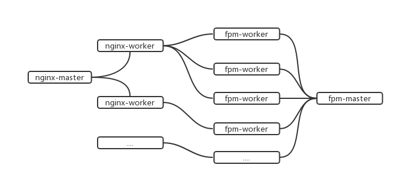

# 1.1 传统php-fpm工作模式的问题

## php-fpm

- Fastcgi进程管理器，实现fastcgi协议
- 同步阻塞IO进程模型
- 请求结束后释放所有资源和内存
- 并发受限于进程数
- PHP框架初始化占用大量的计算资源

## php-fpm工作模式的问题

- nginx基于epoll事件模型，一个worker同时可处理多个请求
- fpm-worker在同一时刻可处理一个请求
- master进程只负责处理worker进程的监控、日志等
- 用户端请求由elb解析，再经过nginx解析
- fpm-worker每次处理请求前需要重新初始化mvc框架，然后再释放资源
- 高并发请求时，fpm-worker不够用，nginx直接响应502
- fpm-worker进程间切换消耗大（如某线上业务在4核8G内存服务器实质可利用16个进程）

# links
  * [目录](<preface-目录.md>)
  * 上一节: [为什么要研发新的PHP框架](<01.0-为什么要研发新的PHP框架.md>)
  * 下一节: [压测数据对比](<01.2-压测数据对比.md>)