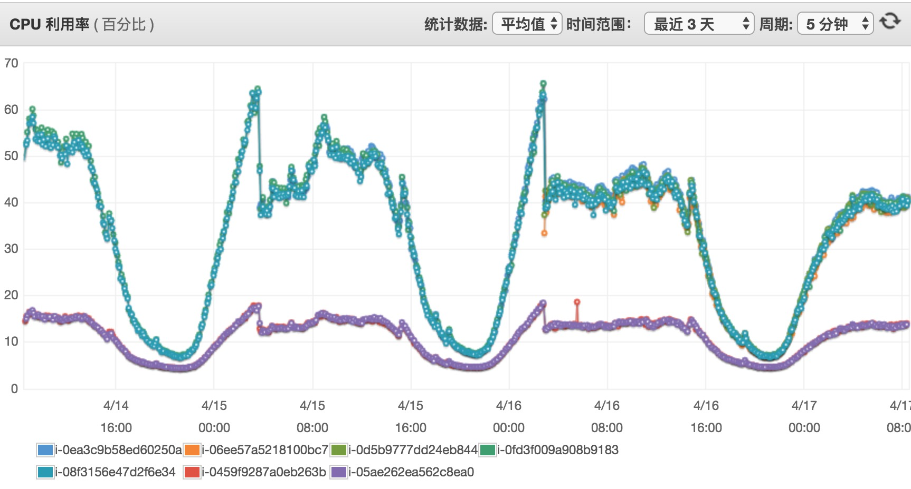

# 2 微服务框架研发概览

微服务框架即“PGWireless Micro Service Framework For PHP”，是Camera360社区服务器端团队基于Swoole自主研发的现代化的PHP服务框架，简称msf或者php-msf，它的核心设计思想是采用协程、异步、并行的创新技术手段提高系统的单机吞吐能力，降低整体服务器成本。

## 主要特性

* 精简版的MVC框架
* IO密集性业务的单机处理能力提升5-10倍
* 代码长驻内存
* 支持对象池
* 支持Redis连接池、MySQL连接池
* 支持Redis分布式、master-slave部署结构的集群
* 支持异步、并行
* 基于PHP Yield实现协程
* 内建http/redis/mysql/mongodb/task等协程客户端
* 纯异步的Http Server
* RPC Server/Client
* 支持命令行模式
* 支持独立进程的定时器
* 支持独立配置进程

## 定位

我们专注打造稳定高性能纯异步基于HTTP的微服务框架，作为nginx+php-fpm的替代技术栈实现架构的微服务化;而Tcp/WebSocket Server将作为插件的形势支持，或者作为其他独立的开源项目。

## 原则

### 简单

由于Swoole复杂的进程模型，并且有同步阻塞和异步非阻塞之分，所以在运行相同代码逻辑时，可能在调用方式、传递参数都不一致，从而直线拉高了学习成本，我们为了屏蔽低层的差异，做了大量的工作，实现和传统MVC框架的唯一区别在于添加“yield”关键字。

### 稳定

php-msf经受了Camera360社区服务大流量、高并发的洗礼，稳定性已经得到验证。

### 高性能

IO密集性业务的单机处理能力提升5-10倍，这是生产环境中得出的真实数据，如Camera360社区某聚合服务在流量高峰需要40台服务器抗住流量，而采用php-msf重构之后只需要4台相同配置的服务器就可以抗住所有流量。

## 协程

目前社区有几个PHP开源项目支持协程，它们大多采用Generator+Yield来实现，但是实现的细微差别会导致性能相差甚远，我们应该认识到协程能够以同步的代码书写方式而运行异步逻辑，故协程调度器的性能一定要足够的高，php-msf的协程调度性能是原生异步回调方式的80%，也就是说某个API采用原生异步回调写法QPS为10000，通过php-msf协程调度器调度QPS为8000。

## 为什么是微服务框架？

目前php-msf还在起步阶段，我们花了大量的时间和精力解决稳定性、高性能、内存问题，因为我们认为“基石”是“万丈高楼”的最基本的保障，只有基础打得牢，才能将“大楼”建设得“更高”。3.0版本是我们开源的起始版本，是我们迈出的重要一步，接下来我们重点会是分布式微服务框架的打磨。

另外，由于基于PHP长驻进程，并直接解析HTTP或者TCP请求，这是服务化最重要的支撑，基于此我们可以做很多原来不敢去实现的想法，总之想像空间很大。

## 某服务重构

### 软硬件

* aws c3.xlarge（4核8G）
* 64个php-fpm进程

### 处理逻辑

* 1次Redis Get
* 1次 MongoDB Query
* 2个广告接口
* 2个业务接口

### 重构前

PHP-5.6/Yii2/OPcache/Http

   n   |   c   |     qps    | 平均响应时间(ms) |  CPU  |
-------|-------|------------|-----------------|-------|
   100 |   1   |       4.16 |      240.168    |    9% |
  5000 |   5   |      15.36 |      325.502    |   46% |
  5000 |  10   |      18.72 |      534.141    |   83% |
  5000 |  50   |      19.03 |     2627.159    |   99% |

PHP-7.0/Yii2/OPcache/Http

   n   |   c   |     qps    | 平均响应时间(ms) |  CPU  |
-------|-------|------------|-----------------|-------|
   100 |   1   |       3.51 |      284.876    |    5% |
  5000 |   5   |      17.23 |      290.129    |   21% |
  5000 |  10   |      32.36 |      309.057    |   40% |
  5000 |  20   |      52.94 |      377.784    |   82% |
  5000 |  40   |      55.52 |      720.433    |   91% |

### 重构后

msf-2.0

   n   |   c   |     qps    | 平均响应时间(ms) |  CPU  |
-------|-------|------------|-----------------|-------|
   100 |   1   |       4.52 |      221.089    |  1.4% |
  5000 |   5   |      40.31 |      248.063    |   14% |
  5000 |  10   |      73.22 |      273.148    |   27% |
  5000 |  20   |     129.63 |      308.575    |   75% |
  5000 |  40   |     172.19 |      475.916    |   99% |

### 资源使用

在处理相同并发请求下，上面的曲线是重构前的，下面的曲线是重构后的。

### 结论

1. 采用新框架重构某服务后，在相同资源消耗的情况下，单机的处理能力提升8倍；
2. 重构前某在正常情况下，提供19qps，CPU使用率为45%左右；
3. 重构后某在正常情况下，提供19qps，CPU使用率为12%左右；
4. 重构后某单机正常情况下，提供120qps，CPU使用率为75%左右；

# links
  * [目录](<preface-目录.md>)
  * 上一节: [第一章小结](<01.3-小结.md>)
  * 下一节: [通信框架技术选型](<02.1-通信框架技术选型.md>)