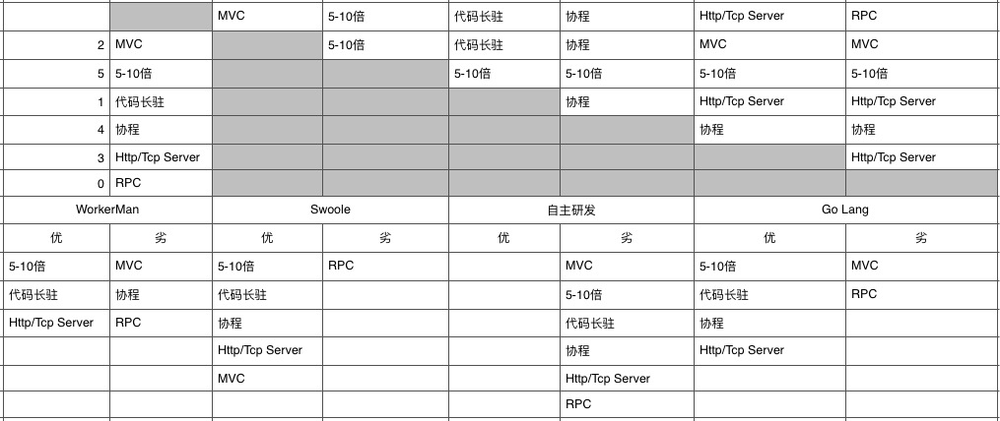

# 2.1 通信框架技术选型

## WorkerMan

### 优势

- 一个高性能的PHP Socket服务器框架
- 支持TCP/UDP
- 纯PHP开发
- 组件丰富

### 劣势

- PHP的内存管理粒度粗
- PHP无法直接调用操作系统API

## Swoole

### 优势

- PHP异步、并行、事件驱动高性能网络通信的 C 扩展
- TCP/UDP/HTTP/WEBSOCKET服务器
- 原生支持异步Redis/MySQL/HttpClient
- 基于epoll的reactor模型
- 稳定
- 社区相当活跃

### 劣势

-组件不够丰富

## 自主开发

### 优势

- 功能定制（select/poll/epoll/Reactor模型/TCP/IP协议等等）
- 灵活度高

### 劣势

- 重复造轮子
- 成本高，时间周期长
- 知识储备不够
- 缺乏人才

## Go

### 优势

- 语言级的高性能高并发
- 协程
- 适合底层后端系统的开发

### 劣势

- 静态语言，开发效率和PHP相差大
- 储备的技术势能不够
- 不符合现有团队的基团
- 缺乏人才

## 优序矩阵

## 技术选型其他因素

- 适合团队/公司的技术栈（PHP）
- 将擅长的技术做到专业领域更深
- 目前后端团队有PHP内核及扩展开发的经验

## 技术选型决策

- C扩展+PHP MVC框架
- 支持PHP7以上版本
- Swoole提供低层Tcp/Http通信
- PHP精简版MVC
- PHP Yield协程调度器
- PHP实现对象池、连接池等特性
- PHP实现RPC Server/Client

# links
  * [目录](<preface-目录.md>)
  * 上一节: [微服务框架研发概览](<02.0-微服务框架研发概览.md>)
  * 下一节: [swoole](<02.2-swoole.md>)