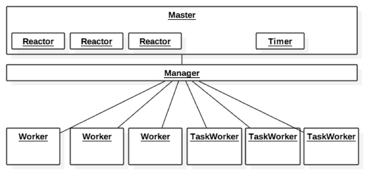
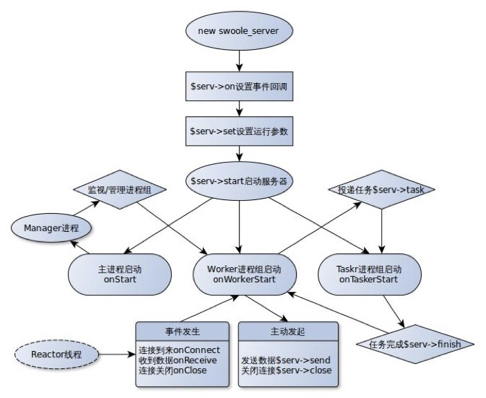

# 2.2 swoole

## 简介

PHP的异步、并行、高性能网络通信引擎，使用纯C语言编写，提供了PHP语言的异步多线程服务器，异步TCP/UDP网络客户端，异步MySQL，异步Redis，数据库连接池，AsyncTask，消息队列，毫秒定时器，异步文件读写，异步DNS查询。 Swoole内置了Http/WebSocket服务器端/客户端、Http2.0服务器端。

## 官网

[https://www.swoole.com](https://www.swoole.com)

## php-msf使用的swoole特性

我们在学习msf之前应该先了解swoole的各种特性,swoole的功能很多,各种使用姿势,本节主要介绍msf框架所使用的swoole主要特性。

### 进程模型

msf框架使用了swoole的进程模式（[更多模式的介绍](https://wiki.swoole.com/wiki/page/353.html)）,进程模型示意图如下:



- 它是一个多进程模型框架，启动时创建2 + n + m个进程；
- 2=1个master进程+1个manager进程
- master进程是Server实例的主进程,负责fork Manager进程及accept用户连接
- manage进程为管理进程,负责创建和管理所有的Worker和TaskWorker进程
- Reactor线程运行在master进程,实际运行epoll实例，用于accept客户端连接以及接收客户端数据
- Worker进程接受Reactor线程分配的用户请求,处理数据后返回给Reactor线程
- TaskWorker进程接受Worker投递的耗时任务,处理完成后执行异步回调函数,通知Worker进程

### 执行流程



### 异步DNS

由于在发起http请求时,通常情况下URL中包含域名,而域名解析是一次UDP的网络请求,通过gethostbyname()函数进行域名解析是同步阻塞的,这与msf研发目标是相违背的,故我们需要异步查询DNS,swoole内置一个纯异步IO实现的异步DNS客户端:

```php
swoole_async_dns_lookup("www.baidu.com", function($host, $ip){
    echo "{$host} : {$ip}\n";
});
```

[更多介绍](https://wiki.swoole.com/wiki/page/186.html)

### 异步Http Client

传统的curl请求是同步阻塞的,不能满足构建纯异步的Server需求,swoole内置异步的http client:

```php
Swoole\Async::dnsLookup("www.baidu.com", function ($domainName, $ip) {
    $cli = new swoole_http_client($ip, 80);
    $cli->setHeaders([
        'Host' => $domainName,
        "User-Agent" => 'Chrome/49.0.2587.3',
        'Accept' => 'text/html,application/xhtml+xml,application/xml',
        'Accept-Encoding' => 'gzip',
    ]);
    $cli->get('/index.html', function ($cli) {
        echo "Length: " . strlen($cli->body) . "\n";
        echo $cli->body;
    });
});
```

[更多介绍](https://wiki.swoole.com/wiki/page/670.html)

### 异步Redis Client

我们常用的phpredis也是同步阻塞的,不能满足构建纯异步的Server需求,swoole内置异步的redis client:

```php
$client = new swoole_redis;
$client->connect('127.0.0.1', 6379, function (swoole_redis $client, $result) {
    if ($result === false) {
        echo "connect to redis server failed.\n"
        return;
    }
    $client->set('key', 'swoole', function (swoole_redis $client, $result) {
        var_dump($result);
    });
});
```

[更多介绍](https://wiki.swoole.com/wiki/page/522.html)

### 异步MySQL Client

我们常用的pdo_mysql/mysqli,不能满足构建纯异步的Server需求,swoole内置异步的mysql client:

```php
$db = new swoole_mysql;
$server = array(
    'host' => '192.168.56.102',
    'port' => 3306,
    'user' => 'test',
    'password' => 'test',
    'database' => 'test',
    'charset' => 'utf8', //指定字符集
    'timeout' => 2,  // 可选：连接超时时间（非查询超时时间），默认为SW_MYSQL_CONNECT_TIMEOUT（1.0）
);

$db->connect($server, function ($db, $r) {
    if ($r === false) {
        var_dump($db->connect_errno, $db->connect_error);
        die;
    }
    $sql = 'show tables';
    $db->query($sql, function(swoole_mysql $db, $r) {
        if ($r === false)
        {
            var_dump($db->error, $db->errno);
        }
        elseif ($r === true )
        {
            var_dump($db->affected_rows, $db->insert_id);
        }
        var_dump($r);
        $db->close();
    });
});
```

[更多介绍](https://wiki.swoole.com/wiki/page/517.html)

### Http Server

我们只需要简单的几行代码就能构建一个健壮的Http Server,因为swoole-1.7.7增加了内置Http服务器的支持，通过几行代码即可写出一个异步非阻塞多进程的Http服务器。

```php
$http = new swoole_http_server("127.0.0.1", 9501);
$http->on('request', function ($request, $response) {
    $response->end("<h1>Hello Swoole. #".rand(1000, 9999)."</h1>");
});
$http->start()
```

[更多介绍](https://wiki.swoole.com/wiki/page/326.html)

### 异步毫秒定时器

msf框架内部的功能实现有基于异步毫秒定时器,比如协程调度,请求超时等等。

[更多介绍](https://wiki.swoole.com/wiki/page/244.html)

### 异步文件系统IO

msf框架写日志是纯异步的IO,也就是说请求结束后,不需要等待日志写入成功就可以处理下一个请求。

[更多介绍](https://wiki.swoole.com/wiki/page/183.html)

### 进程管理

在swoole的进程模式下,我们还可以创建自定义的进程,比如msf框架在server启动时会创建config进程,用于全局配置创建与更新,同时收集server的所有worker运行状态。

[更多介绍](https://wiki.swoole.com/wiki/page/p-process.html)


# links
  * [目录](<preface-目录.md>)
  * 上一节: [通信框架技术选型](<02.1-通信框架技术选型.md>)
  * 下一节: [协程原理](<02.3-协程原理.md>)