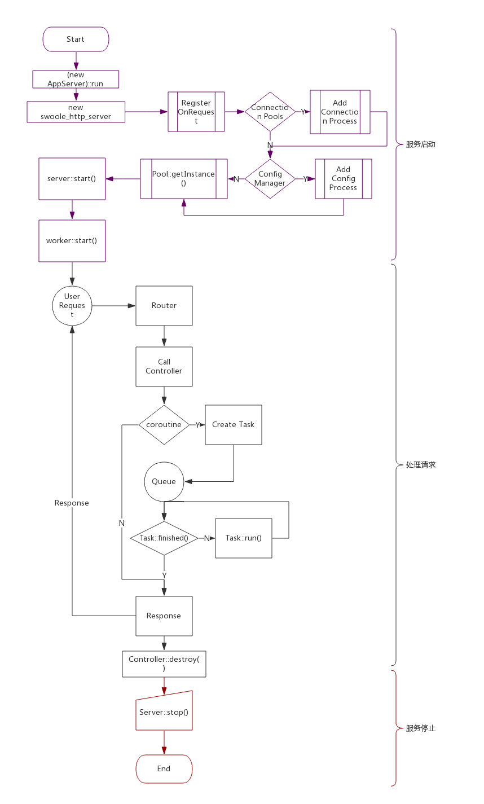

# 4 框架结构

## 处理请求流程图

### 服务启动

框架在服务启动时需要完成初始化的一系列工作:

1. 注册Swoole各种事件回调函数
2. 读取配置文件
3. 注册连接池进程
4. 注册配置管理进程
5. 初始化对象池实例
6. 进入Event Loop事件循环

### 处理请求

1. 根据用户请求的URI路由
2. 判断处理请求的action是否需要协程调度
3. 如2为Y则创建协程Task,将Task压到协程调度的任务队列
4. 协程调度器每1ms调度一次,执行Task::run()
5. Task执行完成,响应用户请求
6. 释放相关资源

## 应用程序目录

建议使用 `app` 作为应用程序目录，业务逻辑都在里面，框架级别的东西也可以通过在 `app` 目录下的继承来修改。

## 入口文件

应用程序需要一个入口启动脚本，并且启动脚本是通过 PHP CLI方式运行的，例如 `server.php`。

## psr4

- 类采用首字母大写的驼峰式命名，类文件名必须与文件内部类名相同
- 使用命名空间，命名空间名字与目录路径对应

# links
  * [目录](<preface-目录.md>)
  * 上一节: [第三章小结](<03.4-小结.md>)
  * 下一节: [结构概述](<04.1-结构概述.md>)