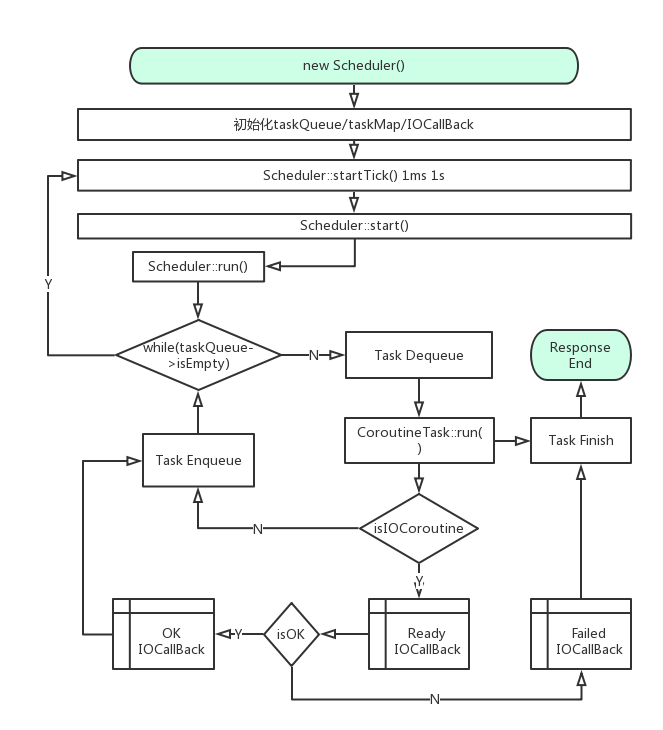

# 5.1 协程

在前面的章节[2.4](<2.4.md>)介绍了协程的原理及PHP用户空间如何实现协程,本节将重点介绍MSF框架的协程如何使用,同时会剖析PHP工程级协程调度器的实现及调度算法。

## 为什么要使用协程?

至于为什么使用协程,可能大家看法还不统一,这里举例来说明,我们实现一个接口,此接口内包含:

2次http请求其他接口A、B,

1次Redis请求C

他们之间的依赖关系为:`((A && B) || C)`

```php
<?php
/**
 * 拉取用户推荐列表
 */
namespace App\Controllers\Api;

use PG\MSF\Controllers\Controller;
use App\Models\Feed;
use App\Tasks\Idallloc;

class Pr extends Controller
{
    /**
     * 异步回调的方式实现(A && B) || C
     */
    public function httpCallBackMode()
    {
        $client = new \swoole_redis;
        $client->connect('127.0.0.1', 6379, function (\swoole_redis $client, $result) {
            $client->get('apiCacheForABCallBack', function (\swoole_redis $client, $result) {
                if (!$result) {
                    swoole_async_dns_lookup("www.baidu.com", function($host, $ip) use ($client) {
                        $cli = new \swoole_http_client($ip, 443, true);
                        $cli->setHeaders([
                            'Host' => $host,
                        ]);
                        $apiA = "";
                        $cli->get('/', function ($cli) use ($client, $apiA) {
                            $apiA = $cli->body;
                            swoole_async_dns_lookup("www.qiniu.com", function($host, $ip) use ($client, $apiA) {
                                $cli = new \swoole_http_client($ip, 443, true);
                                $cli->setHeaders([
                                    'Host' => $host,
                                ]);
                                $apiB = "";
                                $cli->get('/', function ($cli) use ($client, $apiA, $apiB) {
                                    $apiB = $cli->body;
                                    if ($apiA && $apiB) {
                                        $client->set('apiCacheForABCallBack', $apiA . $apiB, function (\swoole_redis $client, $result) {});
                                        $this->outputJson($apiA . $apiB);
                                    } else {
                                        $this->outputJson('', 'error');
                                    }
                                });
                            });
                        });
                    });
                } else {
                    $this->outputJson($result);
                }
            });
        });
    }

    /**
     * 协程的方式实现(A && B) || C
     */
    public function httpCoroutineMode()
    {
        // 从Redis获取get apiCacheForABCoroutine
        $getRedisCoroutine = $this->getRedisPool('tw')->get('apiCacheForABCoroutine');
        $response          = yield $getRedisCoroutine;
        if (!$response) {
            // 从对象池中获取Http Client
            $client     = $this->getContext()->getObjectPool()->get(\PG\MSF\Client\Http\Client::class);
            // 异步dns解析
            $dnsACor    = $client->coroutineGetHttpClient('https://www.baidu.com');
            $dnsBCor    = $client->coroutineGetHttpClient('https://www.qiniu.com');
            // 获取dns解析的结果
            $httClientA = yield $dnsACor;
            $httClientB = yield $dnsBCor;
            // 异步拉取数据
            $resultACor = $httClientA->coroutineGet('/');
            $resultBCor = $httClientB->coroutineGet('/');
            // 获取拉取数据的结果
            $resultA    = yield $resultACor;
            $resultB    = yield $resultBCor;
            // 写入redis
            $setRedisCoroutine = $this->getRedisPool('tw')->set('apiCacheForABCoroutine', $resultA['body'] . $resultB['body']);
            yield $setRedisCoroutine;
            $response   = $resultA['body'] . $resultB['body'];
        }

        // 响应结果
        $this->outputJson($response);
    }
}
```

http://127.0.0.1:8000/api/pr/callbackmode

http://127.0.0.1:8000/api/pr/coroutinemode

1. Swoole实现了异步非阻塞的IO模型它是高性能的基础,但是书写逻辑代码非常复杂,需要多层嵌套回调,阅读和维护困难
2. 基于Yield的协程可以用同步的代码编写方式,达到异步IO的效果和性能,避免了传统异步回调所带来多层回调而导致代码无法维护

## 协程的调度顺序

### 姿势二

```php
<?php
namespace App\Models;

use PG\MSF\Models\Model;

class AppModel extends Model
{
    public function nested()
    {
        $result = [];
        $client = $this->getContext()->getObjectPool()->get(\PG\MSF\Client\Http\Client::class);
        $httpClient1 = yield $client->coroutineGetHttpClient('http://rec-dev.camera360.com:80');
        $httpClient2 = yield $client->coroutineGetHttpClient('http://rec-dev.camera360.com:80');

        $result[] = strlen(yield $httpClient1->coroutineGet('/'));
        $result[] = strlen(yield $httpClient2->coroutineGet('/'));

        return $result;
    }
}
```

### 姿势二

```php
<?php
namespace App\Models;

use PG\MSF\Models\Model;

class AppModel extends Model
{
    public function nested()
    {
        $result = [];
        $client = $this->getContext()->getObjectPool()->get(\PG\MSF\Client\Http\Client::class);
        $httpClient1 = $client->coroutineGetHttpClient('http://rec-dev.camera360.com:80');
        $httpClient2 = $client->coroutineGetHttpClient('http://rec-dev.camera360.com:80');

        $c1 = yield $httpClient1;
        $c2 = yield $httpClient2;

        $r1 = $c1->coroutineGet('/');
        $r2 = $c2->coroutineGet('/');

        $result[] = strlen(yield $r1);
        $result[] = strlen(yield $r2);

        return $result;
    }
}
```

### 解析

两种姿势看上去都使用了协程的yield关键字；姿势一由于协程在调度时，第一个yield没有接收数据时，程序控制流就不会往下继续执行，从而退化为串行请求第三方接口；姿势二由于在进获取httpClient时DNS查询是异步的，就同时进行多个DNS查询，通过yield关键获取协程执行的结果，再同时异步请求多个接口，最后通过yield关键字获取接口响应结果。

通过两种姿势的对比，使用php-msf协程yield关键字，很好的解决了异步IO回调的写法，让程序看上去是同步执行的，yield起来了接收数据的作用，这也是前面所说的yield具有双向通信的最要特性。

姿势一协程调度过程

send http dns1 lookup->rev http dns1 lookup->send http dns2 lookup->rev http dns2 lookup->send get1->rev get1->send get2-> rev get2

姿势二协程调度过程

send http dns1 lookup->send http dns2 lookup->rev http dns1 lookup->rev http dns2 lookup->send get1->send get2->rev get1->rev get2

**需要特别注意的是: 如果某个异步IO操作不需要获取返回值,如设置缓存set key val,框架允许不加yield关键字,这可以大大的提升接口的并发能力**

## 使用MSF协程

通过上述的示例代码,我们不难得出MSF协程的使用方式,通常情况下,我们使用异步客户端发送请求,使用yield关键字获取协程任务的运行结果。

### HttpClient

```php
<?php
function httpClientCoroutine() {
    $client       = $this->getContext()->getObjectPool()->get(\PG\MSF\Client\Http\Client::class);
    $sendDNSQuery = $client->coroutineGetHttpClient('http://rec-dev.camera360.com');
    $httpClient   = yield $sendDNSQuery;
    $sendGetReq   = $httpClient->coroutineGet('/');
    $data         = yield $sendGetReq;
}
```

### Task

```php
<?php
function TaskCoroutine() {
    $category   = $this->getLoader()->task(CategoryTask::class, $this);
    $category->getAll();
    $categories = yield $category->coroutineSend();
}
```

### Redis

```php
<?php

function RedisCoroutine() {
    $sendRedisGet = $this->getRedisPool('tw')->get('apiCacheForABCoroutine');
    $cache        = yield $sendRedisGet;
}
```

## MSF协程调度器

MSF协程调度器是基于Generator/Yield自主研发,它的核心思想是发生任何异步IO操作之后,程序的控制流就切换到其他请求,待异步IO可读之后将任务重新加入到调度队列,待协程调度器下一次调度之后并响应请求。

### 关键技术点

* Generator/Yield
* swoole timer
* SplQueue/SplStack
* taskMap

### 主要特性

* 协程独立堆栈
* 支持嵌套
* 全调用链路异常捕获
* 调度队列统计
* 多入口调度

### 协程调度流程



# links
  * [目录](<preface-目录.md>)
  * 上一节: [框架组件](<05.0-框架组件.md>)
  * 下一节: [类的加载](<05.2-类的加载.md>)