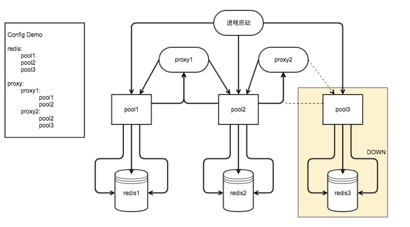

# 5.5 连接池

连接池的重要性,这时就不赘述了,下面具体介绍框架中实现的哪些连接池。

## Redis连接池

### 主要特性

- 支持异步+协程
- 支持断线重连
- 支持自动提取和归还连接
- 统一同步和异步调用方式

### 配置

```php
<?php
/**
 * 本地环境
 */
$config['redis']['p1']['ip']               = '127.0.0.1';
$config['redis']['p1']['port']             = 6379;
//$config['redis']['p1']['password']       = 'xxxx';
//$config['redis']['p1']['select']         = 1;
// Redis序列化选项等同于phpredis序列化的各个选项如:\Redis::SERIALIZER_PHP,\Redis::SERIALIZER_IGBINARY
//$config['redis']['p1']['redisSerialize'] = \Redis::SERIALIZER_PHP;
// PHP序列化选项,为了兼容yii迁移项目的set,get,mset,mget,选项如:\Redis::SERIALIZER_PHP,\Redis::SERIALIZER_IGBINARY
//$config['redis']['p1']['phpSerialize']   = \Redis::SERIALIZER_NONE;
// 是否将key md5后储存,默认为0,开启为1
//$config['redis']['p1']['hashKey']        = 1;
// 设置key的前缀
//$config['redis']['p1']['keyPrefix']      = 'demo_';

return $config;
```

示例配置代码:

[./php-msf/app/config/docker/redis.php](https://github.com/pinguo/php-msf/blob/app/config/docker/redis.php)

- $config['redis']

代表Redis连接池相关配置

- p1,p2,p3,p4,p5,p6

这里的p仅代表一台或者一组Redis服务器,在使用连接池时会用到,如果Redis服务器端分片（比如twemproxy）就填写为集群导出的地址与端口等信息。

- ip

Redis服务器地址

- port

Redis服务器端口

- password

Redis认证密钥

- select

Redis DB

- redisSerialize

Redis序列化选项等同于phpredis序列化的各个选项如:\Redis::SERIALIZER_PHP,\Redis::SERIALIZER_IGBINARY

- phpSerialize

PHP序列化选项,为了兼容yii迁移项目的set,get,mset,mget,选项如:\Redis::SERIALIZER_PHP,\Redis::SERIALIZER_IGBINARY

- hashKey

是否将key md5后储存,默认为0,开启为1

- keyPrefix

设置key的前缀

### Redis连接池的使用

```php
/**
 * Redis示例控制器
 *
 * @author camera360_server@camera360.com
 * @copyright Chengdu pinguo Technology Co.,Ltd.
 */

namespace App\Controllers;

use PG\MSF\Controllers\Controller;
use App\Models\Demo as DemoModel;

class Redis extends Controller
{
    // Redis连接池读写示例
    public function actionPoolSetGet()
    {
        yield $this->getRedisPool('p1')->set('key1', 'val1');
        $val = yield $this->getRedisPool('p1')->get('key1');

        $this->outputJson($val);
    }
}
```

1. $this->getRedisPool($name)

获取连接池对象,并选择名为$name的连接池,$name由配置文件中声明,比如上述配置中的tw

2. 连接池对象的所有方法映射为标准的Redis操作指令

如:`SETEX key seconds value`映射为`$this->getRedisPool($name)->setex($key, $seconds, $value)`

3. string类型的简化操作

`$this->getRedisPool($name)->cache($key, $value = '', $expire = 0)`,`$key`为redis key,`$value`为缓存的值,`$expire`为过期时间,默认不会过期。

4. 执行lua脚本

`$this->getRedisPool($name)->evalMock($script, $args = array(), $numKeys = 0)`

如:

```php
<?php
function luaExample()
{
    $num = 100;
    $lua = "
           local allWorks = {}
           local recWorks = {}
           local random = nil
           for k, v in pairs(KEYS) do
               local works = redis.call('sRandMember', v, '" . $num . "')
               if works ~= nil then
                   for key, val in pairs(works) do
                       table.insert(allWorks, val)
                   end
               end
           end
           while #recWorks < " . $num . " and #allWorks > 0 do
               random = math.random(#allWorks)
               table.insert(recWorks, allWorks[random])
               table.remove(allWorks, random)
           end
           return cjson.encode(recWorks)
       ";
    $keys = ['feedId1', 'feedId2', 'feedId3'];
    $this->getRedisPool('tw')->evalMock($lua, $keys, count($keys));
}
```

## Redis代理

在Redis连接池的基本上,MSF框架还实现了Redis代理的基本功能,主要特性有:

- 支持分布式自动分片
- 支持master-slave读写分离
- 支持故障自动failover

### 配置

```php
<?php
/**
 * 本地环境
 */
$config['redis']['p1']['ip']               = '127.0.0.1';
$config['redis']['p1']['port']             = 6379;
//$config['redis']['p1']['password']       = 'xxxx';
//$config['redis']['p1']['select']         = 1;
// Redis序列化选项等同于phpredis序列化的各个选项如:\Redis::SERIALIZER_PHP,\Redis::SERIALIZER_IGBINARY
//$config['redis']['p1']['redisSerialize'] = \Redis::SERIALIZER_PHP;
// PHP序列化选项,为了兼容yii迁移项目的set,get,mset,mget,选项如:\Redis::SERIALIZER_PHP,\Redis::SERIALIZER_IGBINARY
//$config['redis']['p1']['phpSerialize']   = \Redis::SERIALIZER_NONE;
// 是否将key md5后储存,默认为0,开启为1
//$config['redis']['p1']['hashKey']        = 1;
// 设置key的前缀
//$config['redis']['p1']['keyPrefix']      = 'demo_';

$config['redis']['p2']['ip']               = '127.0.0.1';
$config['redis']['p2']['port']             = 6380;

$config['redis']['p3']['ip']               = '127.0.0.1';
$config['redis']['p3']['port']             = 6381;

$config['redis']['p4']['ip']               = '127.0.0.1';
$config['redis']['p4']['port']             = 7379;

$config['redis']['p5']['ip']               = '127.0.0.1';
$config['redis']['p5']['port']             = 7380;

$config['redis']['p6']['ip']               = '127.0.0.1';
$config['redis']['p6']['port']             = 7381;

$config['redis_proxy']['master_slave'] = [
    'pools' => ['p1', 'p2', 'p3'],
    'mode' => \PG\MSF\Marco::MASTER_SLAVE,
];

$config['redis_proxy']['cluster'] = [
    'pools' => [
        'p4' => 1,
        'p5' => 1,
        'p6' => 1
    ],
    'mode' => \PG\MSF\Marco::CLUSTER,
];

return $config;
```

示例配置代码:

[./php-msf/app/config/docker/redis.php](https://github.com/pinguo/php-msf/blob/app/config/docker/redis.php)

- $config['redis_proxy']

代表Redis代理相关配置

- cluster

这里的cluster仅代表一组Redis服务器集群,是一个标识

- mode

Redis集群类型,\PG\MSF\Marco::CLUSTER代表分布式的Redis集群;\PG\MSF\Marco::MASTER_SLAVE代表主从结构的Redis集群

- pools

当mode设置为\PG\MSF\Marco::CLUSTER时,pools为array,他的key表示Redis连接池名称,value表示Redis连接池权重;当mode设置为\PG\MSF\Marco::MASTER_SLAVE,pools为英文逗号分隔的Redis连接池名称列表。

### Redis代理的使用

```php
<?php
/**
 * Redis示例控制器
 *
 * @author camera360_server@camera360.com
 * @copyright Chengdu pinguo Technology Co.,Ltd.
 */

namespace App\Controllers;

use PG\MSF\Controllers\Controller;
use App\Models\Demo as DemoModel;

class Redis extends Controller
{
    // Redis代理使用示例（分布式）
    public function actionProxySetGet()
    {
        for ($i = 0; $i <= 100; $i++) {
            yield $this->getRedisProxy('cluster')->set('proxy' . $i, $i);
        }

        $val = yield $this->getRedisProxy('cluster')->get('proxy22');
        $this->outputJson($val);
    }

    // Redis代理使用示例（主从）
    public function actionMaserSlaveSetGet()
    {
        for ($i = 0; $i <= 100; $i++) {
            yield $this->getRedisProxy('master_slave')->set('M' . $i, $i);
        }

        $val = yield $this->getRedisProxy('master_slave')->get('M66');
        $this->outputJson($val);
    }
}

```

## Redis连接池与代理的关系



## MySQL连接池

### 配置

```php
<?php
/**
 * Docker环境
 */
$config['mysql']['test']['host']           = '192.168.1.106';
$config['mysql']['test']['port']           = 6379;
$config['mysql']['test']['user']           = 'user';
$config['mysql']['test']['password']       = 'password';
$config['mysql']['test']['charset']        = 'utf8';
$config['mysql']['test']['database']       = 'db';
return $config;
```

示例配置代码:

[./php-msf/app/config/docker/mysql.php](https://github.com/pinguo/php-msf/blob/app/config/docker/mysql.php)


### 执行SQL

```php
<?php
/**
 * MySQL示例控制器
 *
 * @author camera360_server@camera360.com
 * @copyright Chengdu pinguo Technology Co.,Ltd.
 */

namespace App\Controllers;

use PG\MSF\Controllers\Controller;

class MySQL extends Controller
{
    // MySQL连接池示例
    public function actionBizLists()
    {
        $DBBuilder = $this->getMysqlPool('test')->getDBQueryBuilder();
        $bizLists  = yield $DBBuilder->select("*")->from('t_biz')->go();

        $this->outputJson($bizLists);
    }
}
```

示例代码:

[./php-msf/app/Controllers/MySQL.php](https://github.com/pinguo/php-msf/blob/app/app/Controllers/MySQL.php)


# links
  * [目录](<preface-目录.md>)
  * 上一节: [请求上下文](<05.4-请求上下文.md>)
  * 下一节: [对象池](<05.6-对象池.md>)