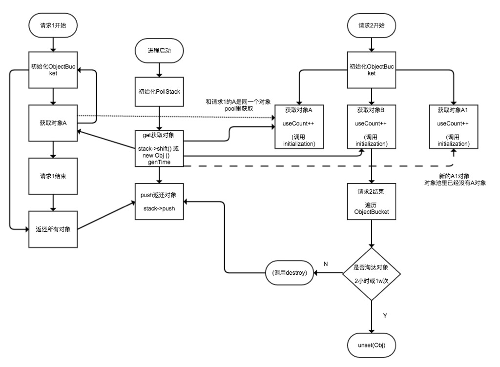
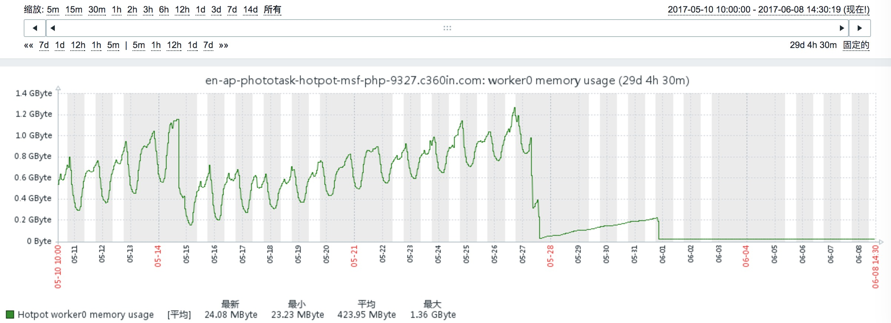

# 5.6 对象池

对象池服务可以减少从头创建每个对象的系统开销。在需要对象时从池中提取,在使用完对象时，把它放回池中,等待下一个请求。对象池使你能够控制所使用的对象数量。在PHP的长驻进程模式下,对象池尤其重要,由于PHP的GC缺陷,在高并发下,PHP长驻进程内直接通过new创建对象,会导致PHP进程占用大量的内存,而且很容易出现OOM(out of memory)。

## 主要特性

- 创建固定数量的对象；
- 需要时从池中提取，不需要时归还池中；
- 自动归还对象；
- 根据有效期和使用次数淘汰对象

## 获取对象池

```
$this->getContext()->getObjectPool()
```

理论上基于MSF框架的任何代码都可以通过请求上下文对象来获取对象池对象

## 获取对象

如获取Http Client对象:

```
$client = $this->getContext()->getObjectPool()->get(\PG\MSF\Client\Http\Client::class)
```

### 初始化对象

虽然我们使用了对象池模式，但我们也可以使用__construct()方法，无须额外调用初始化方法。

```
$this->getContext()->getObjectPool()->get(FeedComment::class, ['构造参数1', '构造参数2', ...]);
```

### 资源释放

className::destroy()

每一个类,理论上都需要定义destroy()方法,用于资源的手工释放,但是不需要显示调用,在请求结束时由框架自动调用。

对于和请求相关的数据,理论上我们是需要在请求结束后释放相关资源,框架对于资源释放的策略及优先级如下:

1. 响应请求后调用Controller::destroy()
2. 依次调用当前请求所使用的对象的destroy()方法
3. 将所有public的类属性的值设置为初始值

通常情况下,destroy方法用于处理private,protected的类属性,public由框架自动清理。

如下示例:

```php
<?php
/**
 * Demo模型
 */
namespace App\Models;

use PG\MSF\Models\Model;

class Demo extends Model
{
    public $pro1;
    public $pro2;

    protected $pro3;
    private $pro4;

    public function __construct($pro1, $pro2)
    {
        parent::__construct();
        $this->pro1 = $pro1;
        $this->pro2 = $pro2;
        $this->pro3 = "protected";
        $this->pro2 = "private";
    }

    public function getMockIds()
    {
        // 读取配置后返回
        return $this->getConfig()->get('params.mock_ids', []);
    }

    public function destroy()
    {
        parent::destroy();
        $this->pro3 = null;
    }
}
```

1. pro1,pro2属性由框架自动在请求结束后赋值为初始值

2. pro3由业务手工在destroy()内清理

3. pro4长驻进程，永久使用

### 资源释放级别

除了上述资源释放策略，php-msf还提供自定义的资源释放策略，只需要在获取对象时提供第三个参数，如：

```php
function DS()
{
    $this->getObject(Demo::class, [1, 2], \Marco::DS_PUBLIC | \Marco::DS_PROTECTED);
}
```

1. Marco::DS_PUBLIC 为默认策略

2. Marco::DS_PROTECTED 为释放protected属性

3. Marco::DS_PRIVATE 为释放private属性

4. Marco::DS_NONE 不释放任何属性

## 对象池实现原理



## PHP进程内存优化

对象池模式对PHP进程占用的内存优化可以说“完全超出预期”,如下图所示:



上图为近30天基于MSF重构的某业务其中一台机器的一个worker进程内存占用的监控数据,从图中有几点:

1. 5-10~5-27,近15天内存占用波峰达1.25G,波谷的值在持续的攀升;
2. 5-27~5-31,近5天内存占用从一个较低的点持续攀升;
3. 6-01之后,内存占用持续稳定在25M上下小辐波动;

在1阶段,框架大量类的对象是直接使用new关键字创建,完全依赖的PHP GC进行内存资源的回收;

在2阶段,框架采用对象池的方案完全重构大量的逻辑,效果很明显,但仍然有部分内存泄露;

在3阶段,优化了业务逻辑,完全按照“资源释放”的策略调整业务代码,内存占用已稳定。


# links
  * [目录](<preface-目录.md>)
  * 上一节: [连接池](<05.5-连接池.md>)
  * 下一节: [RPC](<05.7-RPC.md>)